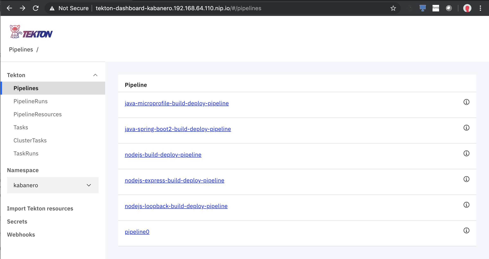
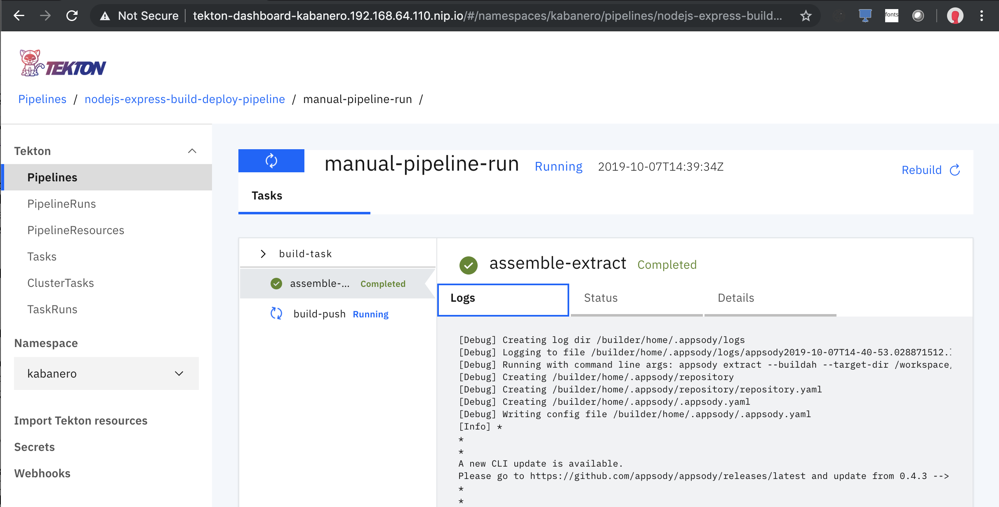
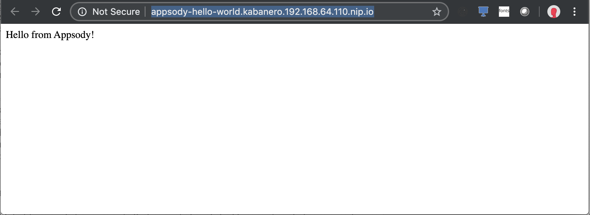

# Kabanero on Minishift

## Table of Contents

- [Overview](#overview)
- [Usage](#usage)
- [Install](#install)
- [Validate installation](#validate-installation)
  * [Openshift Console](#openshift-console)
  * [Tekton Dashboard](#tekton-dashboard)
- [Running a pipeline](#running-a-pipeline)
- [Cleaning up all pipeline runs](#cleaning-up-all-pipeline-runs)
- [Uninstall](#uninstall)

<small><i><a href='http://ecotrust-canada.github.io/markdown-toc/'>Table of contents generated with markdown-toc</a></i></small>

## Overview

[Kabanero](https://kabanero.io/) is an open source project focused on bringing together foundational open source technologies into a modern microservices-based framework. If you are familiar with Kabanero, continue with the technical bits below, otherwise you may want to take a brief look at the [Kabanero overview guide](https://kabanero.io/guides/overview/).

Kabanero is tested on [OKD](https://www.okd.io/), the open source community distribution of Kubernetes for Red Hat OpenShift. [Minishift](https://docs.okd.io/latest/minishift/index.html) is a tool for running a single-node OKD cluster.

Minishift is not officially supported by Kabanero, so this set of scripts shows how a developer *could* run Kabanero on Minishift when experimenting with the technology. Kabanero on Minishift gives you a small footprint, low latency short-loop for running Kabanero samples and developing the various components of a Kabanero-based CI/CD pipeline, such as [Appsody](Appsody.dev) applications, Appsody stacks, [Tekton](https://tekton.dev/) Pipelines, and others.


## Usage

As a disclaimer, this script was primarily developed and tested on MacOS Mojave, though it should work on Windows 10 Pro/Enterprise and Ubuntu installations as well. For Windows 10, these instructions were tested in [Cygwin](https://www.cygwin.com/) shell running as an Administrator (a Minishift requirement), adding the non-default "unzip" package to the Cygwin installation. Windows 10 users should also note that the script currently hardcodes the name "External Virtual Switch" for the Hyper-V external virtual switch.

The main script for deploying Kabanero on Minishift is kabanero-minishift.sh, which is capable of installing Kabanero on a new Minishift profile, trigger manual runs of a sample Kabanero pipeline, and also remove the Kabanero installation.

In order to get started with the deployment, clone this repository and inspect the command-line options, with the following commands:

```
git clone https://github.com/nastacio/kabanero-minishift.git
cd kabanero-minishift/scripts
./kabanero-minishift.sh -h
```

You should see output like this:

```
Creates the Kabanero foundation environment for local development.

For problems related to Minishift, please refer to the Minishift troubleshooting guide:
https://docs.okd.io/latest/minishift/troubleshooting/index.html

Usage: kabanero-minishift.sh [OPTIONS]...[ARGS]

  -i  | --install    Installs and configures Kabanero on an OKD installation using minishift.
  -p  | --profile <profile_name>
                     Optional name for the minishift profile. Default is kabanero.
  -d  | --vm-driver <hypervisor_driver>
                     Optional choice for the vm-driver. Default is kvm.
                     Default for MacOS is hyperkit.
        --clean-pipelines
                     Delete all Tekton pipelines and related objects from Kabanero.
  -t  | --teardown   Uninstalls the minishift Kabanero VM.
      | --validate   Triggers a manual run of a Kabanero pipeline.
  -r  | --remote-registry
                     Indicates whether a remote docker registry should be used.
      | --registry-url <docker_registry>
                     URL of remote docker registry. Default is: 
                     Only used if --remote-registry was specified.
      | --registry-user <docker_user>
                     User in remote docker registry
                     Only used if --remote-registry was specified.
      | --registry-password <docker_password>
                     Password for docker user in remote docker registry
                     Only used if --remote-registry was specified.
      | --registry-email <docker_email>
                     Email account of docker user in remote docker registry
                     Only used if --remote-registry was specified.

  -v  | --verbose    Prints extra information about each command.
  -h  | --help       Output this usage statement.
```

## Install

The installation procedure deploys the [Kabanero Foundation](https://kabanero.io/operations/) on a Minishift profile named "kabanero".

The script will execute the following steps:

* Verify the core prerequisites for Minishift and redirect users to instructions on how to install these prerequisites if missing
* Install Minishift if not already installed
* Start Minishift with a profile named "kabanero"
* Install and start Kabanero Foundation on Minishift


Start the installation with:

```
./kabanero-minishift.sh -i
```

The command will take a few minutes to run, producing output similar to the output below, which is truncated for the purposes of illustration:

```
Mon, 07 Oct 2019 07:58:56 -0400  INFO: Initiating Kabanero installation on minishift.
Mon, 07 Oct 2019 07:59:01 -0400  INFO: Checking if hypervisor hyperkit is installed.
Mon, 07 Oct 2019 07:59:03 -0400  INFO: Starting minishift profile kabanero

...

-- Starting Minishift VM ...................... OK

...

-- Starting OpenShift cluster ...............................................
...
Mon, 07 Oct 2019 08:04:07 -0400  INFO: Starting Kabanero installation
+ KABANERO_BRANCH=0.1.2
+ '[' -z 192.168.64.110.nip.io ']'

...

+ oc get crd extensions.dashboard.tekton.dev
NAME                              CREATED AT
extensions.dashboard.tekton.dev   2019-10-07T12:06:07Z
Mon, 07 Oct 2019 08:06:25 -0400  INFO: Waiting for all containers to be created.
NAMESPACE               NAME                                            READY     STATUS              RESTARTS   AGE
istio-system            prometheus-7d9fb4b69c-5v8wv                     0/1       ContainerCreating   0          2m
kabanero                appsody-operator-549fd759c8-shkgk               0/1       ContainerCreating   0          20s
kabanero                kabanero-cli-654564cb49-dd987                   0/1       ContainerCreating   0          12s

...

+ oc get crd extensions.dashboard.tekton.dev
NAME                              CREATED AT
extensions.dashboard.tekton.dev   2019-10-07T12:06:07Z
Mon, 07 Oct 2019 08:06:25 -0400  INFO: Kabanero installation on minishift is complete.
Mon, 07 Oct 2019 08:06:25 -0400  INFO: You can access the Tekton dashboard in your browser through the following route.
|-----------|------------------|---------------------------------------------------------|
| NAMESPACE |       NAME       |                        ROUTE-URL                        |
|-----------|------------------|---------------------------------------------------------|
| kabanero  | tekton-dashboard | https://tekton-dashboard-kabanero.192.168.64.110.nip.io |
|-----------|------------------|---------------------------------------------------------|
```


## Validate the installation

Many of the Minishift and Kabanero initialization steps occur asynchronously, so that the successful completion of the installation steps does not guarantee that the final Kabanero installation is fully operational.

In order to ensure that the entire installation is fully operational, we can can follow the sections below, accessing the OKD Console, the Tekton dashboard, and then completing a run of a Kabanero pipeline to provision a sample application.


### OKD Console

Once Minishift and Kabanero are up and running, you can visually inspect the results of the installation.

To launch the OKD console, enter the following in the command-line:

```
minishift --profile kabanero console
```

You should see the [OKD login screen](images/okd-login.png) in your default browser and be able to login with the system user and password for OKD (the default user and password is `system:admin`).

A successful login means Minishift is working properly. If you are interested in OKD itself, you can follow the [Web Console Walkthrough](https://docs.okd.io/latest/getting_started/developers_console.html) in the OKD website to explore other functionality.

If you would like to understand more about how Minishift can help with your other development activities, you can also refer to the article titled [Learn OpenShift with Minishift](https://www.redhat.com/sysadmin/learn-openshift-minishift)

### Tekton Dashboard

The next level of validation is to browse around the Tekton dashboard, which is installed indirectly with the Kabanero Foundation.

You can launch the dashboard by running the following command:

```
minishift --profile kabanero openshift service tekton-dashboard --in-browser
```

This command will display the URL for the dashboard and proceed to launch it in your default browser:

```
Opening the route/NodePort https://tekton-dashboard-kabanero.192.168.64.110.nip.io in the default browser...
```

Once the dashboard is launched, you may be prompted for OKD user credentials if you are not already logged into the OKD console. Once again, you can use the system user and password.

You should see a list of available pipelines in the "Tekton/Pipelines" tab:

. 


## Running a pipeline

The final test of a Kabanero installation is to trigger a pipeline run, which will pull code from an Appsody application stored in a GitHub repository, reassemble the source tree, build it, and then, ultimately, deploy it to the OKD cluster as a Knative microservice.

Start the pipeline run with the following commands:

```
cd scripts
./kabanero-minishift.sh --validate
```

This command may take a few minutes to complete, producing output similar to the output below, which is truncated for illustrative purposes:

```
...

+ oc -n kabanero apply -f -
pipelinerun.tekton.dev/manual-pipeline-run created
Mon, 07 Oct 2019 10:39:27 -0400  INFO: Waiting to assess pipeline status.
NAME                  SUCCEEDED   REASON    STARTTIME   COMPLETIONTIME
manual-pipeline-run   Unknown     Running   0s              
```

The validation process will continue monitoring the pipeline run through its end, then dump all resulting logs on the console.

You can also follow the pipeline run status and logs from the Tekton dashboard, through the "Pipeline Run" tab.

. 

Once the run is completed, you should see a newly generated docker image for the project:

```
eval $(minishift docker-env)
docker images | grep "kabanero/node"

172.30.1.1:5000/kabanero/nodejs-express    <none>     460bf9561eb3        8 minutes ago       231MB
```

This sample defers the instanstiation of the application to the serving module of [Knative](https://cloud.google.com/knative/). You should also see the new Knative route created for the application with the following command:

```
oc get route.serving.knative.dev -l "serving.knative.dev/service=appsody-hello-world" -n kabanero 

NAME                  URL                                                         READY     REASON
appsody-hello-world   http://appsody-hello-world.kabanero.192.168.64.110.nip.io   True      
```

This Kabanero pipeline for nodes-express applications defers the instantiation of the application to Knative, which gives it scale-to-zero characteristics. Once you launch that URL for the first time, you will notice that it will take a few moments for the URL to be returned, since Knative will need to spin up Kubernetes pod and the Minishift installation is tuned for resource frugality rather than high performance. On occasion, you may even receive a "504 Gateway timeout" response from Knative until the Kubernetes pod for the application is ready. If that happens, just hit "Refresh" on your web-browser.

You can also see the status of the Kubernetes pod running the sample application with the following command:

```
oc get pods -n kabanero -l="serving.knative.dev/service=appsody-hello-world"

NAME                                                    READY     STATUS    RESTARTS   AGE
appsody-hello-world-wwhhg-deployment-597f68f575-p4nd9   2/2       Running   0          1m


curl http://appsody-hello-world.kabanero.192.168.64.110.nip.io/

Hello from Appsody!
```



After a few minutes of inactivity, you should see Knative removing the pod created to serve requests for the application:

```
oc get pods -n kabanero -l="serving.knative.dev/service=appsody-hello-world"

No resources found.
```

## Cleaning up all pipeline runs

Successive pipeline runs will create more and more resources inside OKD, so at some point you may just want to delete all resources created so far:

```
cd scripts
./kabanero-minishift.sh --clean-pipelines

...
pipelinerun.tekton.dev "manual-pipeline-run" deleted
pipelineresource.tekton.dev "docker-image" deleted
pipelineresource.tekton.dev "git-source" deleted
...
```


## Uninstall

There may be multiple scenarios where you end up needing to tear-down the whole Minishift "kabanero" profile, which can be accomplished with the `--teardown` command option, as follows:

```
cd scripts
./kabanero-minishift.sh --teardown
```

You will be prompted a couple of times to continue and delete the profile, with screen prompts looking like the output below:

```
...
You are deleting the Minishift VM: 'kabanero'. Do you want to continue [y/N]?: y
Removing entries from kubeconfig for cluster: 192-168-64-110:8443
Deleting the Minishift VM...
Minishift VM deleted.
You are deleting the active profile. It will remove the VM and all related artifacts. Do you want to continue [y/N]?: y
Profile 'kabanero' deleted successfully.
Switching to default profile 'minishift' as the active profile.

```
